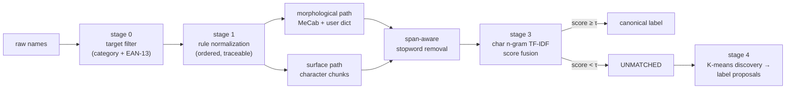

**English** | [한국어](README.ko.md)

# MenuNorm — Korean Product-Name Standardization

[](https://github.com/pmy02/Data_Standardization/actions)
[](pyproject.toml)
[](LICENSE)

A reproducible pipeline that standardizes noisy Korean product names
(`★짜장면★ 500ml`, `ICE 녹차라떼 (포장)`, `HOT choco떼`) into a canonical
label inventory — with rule tracing, abstention, automatic label discovery,
and a fully measurable open benchmark.

```
[강남점] ▶양장피 2개◀   →  양장피      (score 1.00)
(본점) 새우버거 셋트     →  새우버거    (score 1.00)
HOT choco떼 (2인)       →  초코라떼    (score 0.55, fuzzy)
돌 비솥빔밥             →  돌솥비빔밥  (score 0.61, fuzzy)
```

## Overview

This project began as a 2023 industry collaboration with a digital-platform
company: standardizing **~20M raw product records into ~1K canonical labels**
so that downstream search and analytics could work on clean categories. The
engagement data is under NDA and cannot be released, and the original
implementation was a set of ad-hoc notebooks in which normalization rules
were edited by hand, one regex at a time.

This repository is the **systematized rebuild** of that work:

- the method is a configurable, tested Python package (`menunorm`) instead of
  notebooks — every rule lives in version-controlled configuration and emits
  an audit trace;
- the NDA problem is solved with a **deterministic synthetic benchmark** that
  reproduces the documented noise modes of the real data, so every number in
  this README is *measured*, on data anyone can regenerate with one command;
- the original notebooks are preserved unmodified (comments translated) under
  [`notebooks/legacy/`](notebooks/legacy) for provenance.

## Method



| Stage | What it does | Replaces (2023 version) |
|---|---|---|
| **0 — Target filter** | Drops non-food stores and rows with a *valid* EAN-13 check digit (packaged retail goods). | Same idea, now unit-tested. |
| **1 — Rule normalization** | Ordered, declarative rules (glossary translation, bracket/decoration removal, option patterns, spelling variants) with a per-row `rules_fired` trace. | Hand-edited regexes saved as `ver26.xlsx → ver27.xlsx`. |
| **2 — Dual segmentation** | MeCab with a **compiled domain user dictionary** *and* a dependency-free surface segmentation; stopwords are removed **span-aware**, so over-segmented stopwords (시그니처 → 시그/니/처) still match. | Okt nouns + manual dictionary spreadsheet. |
| **3 — Canonicalization + fusion** | Both segmentations are scored against the canonical lexicon (exact + char 2–4-gram TF-IDF cosine); the higher-scoring candidate wins. Scores below the threshold **abstain** (`UNMATCHED`) instead of forcing a label. | One-by-one manual mapping. |
| **4 — Evaluation + discovery** | Gold metrics, per-path ablation, threshold sweep; unmatched names are clustered (K-means) and each cluster's most frequent member is proposed as a *new* label for review. | K-means used once as EDA. |

**Why fusion?** Morphological analysis is brittle under spacing noise (MeCab
loses characters on `돼 지국밥` and tags `쫄면` as a verb form), while pure
surface matching is weaker on glued compounds. Scoring both candidates and
taking the per-row max keeps the strengths of each — and the ablation below
quantifies it instead of asserting it.

## Results

All numbers are measured on the open synthetic benchmark
(20,000 rows, seed 42, single command to reproduce — see
[Reproducibility](#reproducibility)). The benchmark has two tracks:

- **standard** — noise drawn from the documented real-world modes
  (decorations, options, spacing, code-switching, spelling variants,
  branch prefixes, retail/non-food contamination);
- **hard** — standard noise **plus character-level typos** (deletion,
  transposition, duplication) that are deliberately *not covered by any
  lexicon*, probing fuzzy-matching robustness rather than lookup coverage.

| Track | Coverage | Matched acc. | Overall acc. | Unique raw → labels | Filter leakage |
|---|---:|---:|---:|---|---:|
| standard | 99.99 % | 100.0 % | **99.99 %** | 6,228 → 132 | 0 rows |
| hard | 98.32 % | 99.64 % | **97.97 %** | 7,259 → 132 | 0 rows |

> **Read the standard track honestly:** the generator and the lexicons share
> the same domain vocabulary, so near-perfect scores there mean
> *"the pipeline fully inverts every known noise mode"* — a closed-world
> regression test, not a real-world claim. The hard track exists precisely
> because of that: its typos are unseen by every lexicon.

**Ablation (hard track, overall accuracy)** — fusion beats either
segmentation alone:

| Path | Coverage | Matched acc. | Overall acc. |
|---|---:|---:|---:|
| morphological only (MeCab + user dict) | 96.16 % | 99.27 % | 95.46 % |
| surface only | 98.18 % | 99.72 % | 97.90 % |
| **fused (max score)** | **98.32 %** | 99.64 % | **97.97 %** |

**User dictionary effect** (real MeCab output; stock dictionary
over-segments food loanwords):

| Term | Stock mecab-ko-dic | + compiled user dict |
|---|---|---|
| 아인슈페너 | `아인 / 슈페너` | `아인슈페너` |
| 크로플 | `크로 / 플` | `크로플` |
| 마라샹궈 | `마라 / 샹 / 궈` | `마라샹궈` |
| 알리오올리오 | `알 / 리오 / 올리 / 오` | `알리오올리오` |

**Long-tail collapse** — the core value of standardization. 7,259 raw
variants collapse onto 132 canonical labels:


**Abstention trade-off** — the threshold is a dial between coverage and
precision; the operating point (τ = 0.45) is chosen from this sweep, which
the pipeline re-emits on every run:


The full 20k-row run takes **< 1 second** end to end (single core,
Python 3.12).

### Original engagement (2023, NDA)

For context: the original collaboration reported standardizing **~20M raw
records into ~1K labels at ~95 % accuracy** (hand-audited sample). Those
numbers describe the 2023 project on proprietary data and are **not
reproducible from this repository**; everything else in this README is
measured on the open benchmark above.

### Known limitations

- The benchmark is synthetic; absolute numbers are optimistic relative to
  open-world production data (unknown typo classes, OCR noise, new menu
  trends). The hard track narrows but does not close this gap.
- Code-switching recovery depends on the offline glossary; unseen
  romanizations (e.g. `kimchi jjigae`) correctly fall through to
  `UNMATCHED` rather than being guessed.
- The canonical inventory (132 labels) is small; scaling experiments
  (1K+ labels, ANN search) are on the roadmap.

## Installation

```bash
git clone https://github.com/pmy02/Data_Standardization.git
cd Data_Standardization
pip install -e ".[mecab,figures,dev]"
```

`python-mecab-ko` ships Linux/macOS wheels. Without it the pipeline
automatically falls back to the surface tokenizer (`tokenizer: simple`) and
stays fully runnable — CI tests both paths.

## Usage

```bash
# 1) generate the open benchmark (deterministic, ~1.5 MB)
python scripts/generate_synthetic.py --n 20000 --seed 42
python scripts/generate_synthetic.py --n 20000 --seed 42 --hard \
    --out data/synthetic/menu_synthetic_hard.csv

# 2) run the pipeline
python scripts/run_pipeline.py --config configs/default.yaml
python scripts/run_pipeline.py --config configs/default.yaml \
    --input data/synthetic/menu_synthetic_hard.csv --outdir results/hard

# 3) figures (README plots)
python scripts/make_figures.py --results results/hard --out docs/figures
```

Outputs land in the run directory: `standardized.csv` (with per-row score,
match path and `rules_fired` audit trace), `metrics.json` (including the
ablation), `threshold_sweep.csv`, `label_proposals.csv`,
`rule_trace_sample.csv`.

Library use:

```python
from menunorm import Canonicalizer, RuleSet

rules = RuleSet(translation_map={"americano": "아메리카노"})
matcher = Canonicalizer(["아메리카노", "카페라떼", "김치찌개"])

clean = rules.apply("★ICE Americano 세트★")    # -> "아메리카노"
matcher.match([clean])                          # -> 아메리카노, score 1.0
```

To run on your own data, point `configs/default.yaml` at your CSV and map
your column names under `columns:` (set `gold:` only if you have labels).

## Project structure

```
├── src/menunorm/          # the package
│   ├── rules.py           #   stage 1: declarative, traceable normalization
│   ├── tokenize.py        #   stage 2: MeCab/simple + span-aware stopwords
│   ├── dictionary.py      #   MeCab user-dictionary builder (unicode jongseong)
│   ├── canonicalize.py    #   stage 3: exact + char n-gram TF-IDF + abstention
│   ├── cluster.py         #   stage 4: K-means label discovery
│   ├── evaluate.py        #   metrics + threshold sweep
│   ├── synthetic.py       #   open benchmark generator (standard/hard tracks)
│   ├── barcode.py         #   EAN-13 validation (stage 0)
│   └── pipeline.py        #   orchestration + artifacts
├── configs/default.yaml   # every knob in one place
├── data/lexicon/          # canonical labels, stopwords, variant/translation maps
├── data/sample/           # 200-row committed sample of the benchmark
├── scripts/               # generate_synthetic / run_pipeline / make_figures
├── tests/                 # 30 tests incl. end-to-end pipeline regression
└── notebooks/legacy/      # original 2023 notebooks (provenance)
```

## Reproducibility

Everything in this README regenerates with:

```bash
pip install -e ".[mecab,figures,dev]" && pytest -q
python scripts/generate_synthetic.py --n 20000 --seed 42
python scripts/run_pipeline.py --config configs/default.yaml
```

Deterministic given the seed. Verified with Python 3.12, pandas 3.0.2,
scikit-learn 1.8.0; CI exercises Python 3.10 and 3.12, both tokenizer
backends, lint, the unit suite, and a 1k-row end-to-end smoke run.

## Roadmap

- [ ] Scale the canonical inventory to 1K+ labels with ANN (FAISS) matching
- [ ] Embedding-based matcher (Korean SBERT) as a third fusion candidate,
      with the same ablation protocol
- [ ] Active-learning loop: route low-margin matches into the review queue
- [ ] Hangul jamo-level n-grams for stronger typo robustness on the hard track

## Citation

```bibtex
@software{park2023menunorm,
  author  = {Park, Minyoung},
  title   = {MenuNorm: Korean Product-Name Standardization},
  year    = {2023},
  url     = {https://github.com/pmy02/Data_Standardization}
}
```

## License

MIT — see [LICENSE](LICENSE).

Maintained by [@pmy02](https://github.com/pmy02). Issues and PRs welcome.
