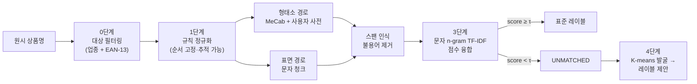
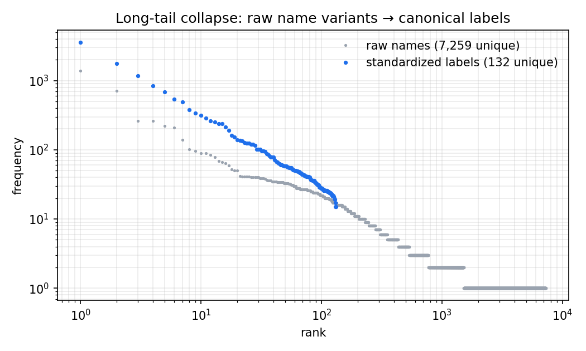
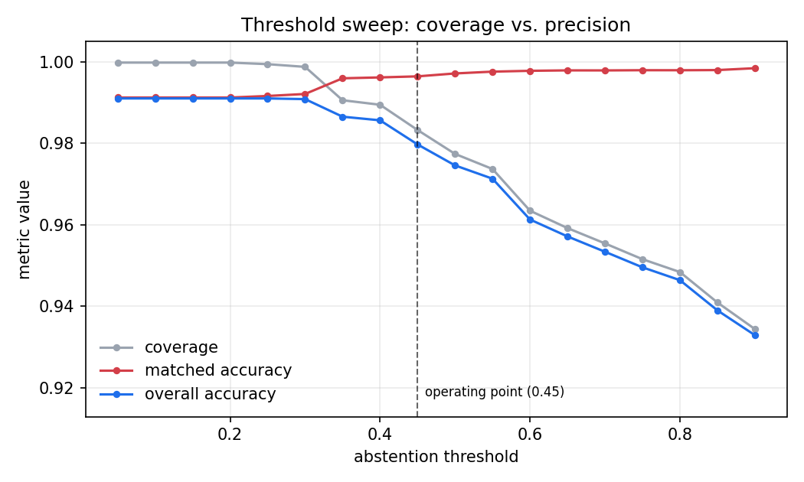
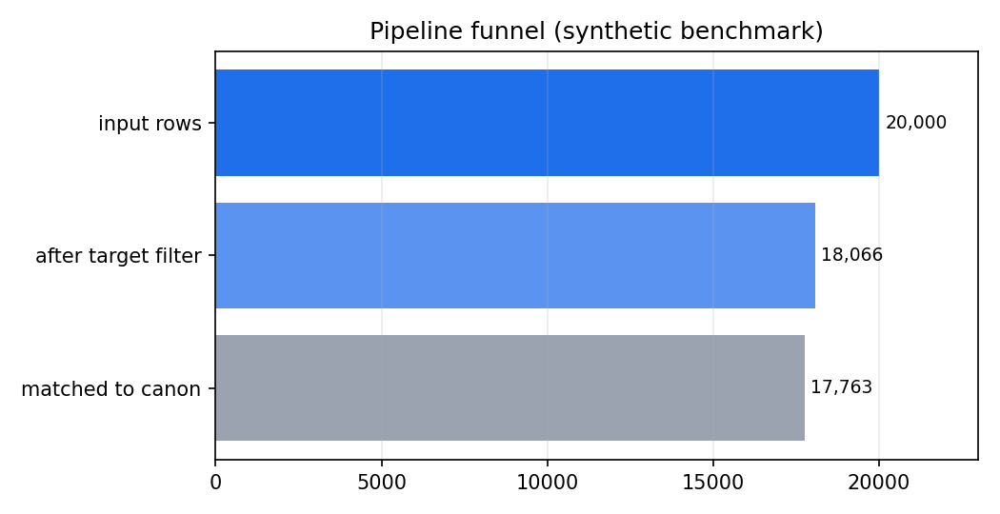

[English](README.md) | **한국어**

# MenuNorm — 한국어 상품명 표준화 파이프라인

[](https://github.com/pmy02/Data_Standardization/actions)
[](pyproject.toml)
[](LICENSE)

`★짜장면★ 500ml`, `ICE 녹차라떼 (포장)`, `HOT choco떼` 같은 노이즈 가득한
한국어 상품명을 표준 레이블로 정규화하는 재현 가능한 파이프라인입니다.
규칙 추적(audit trace), 임계값 기반 보류(abstention), 신규 레이블 자동 발굴,
그리고 누구나 측정 가능한 공개 벤치마크를 갖추고 있습니다.

```
[강남점] ▶양장피 2개◀   →  양장피      (score 1.00)
(본점) 새우버거 셋트     →  새우버거    (score 1.00)
HOT choco떼 (2인)       →  초코라떼    (score 0.55, 퍼지 매칭)
돌 비솥빔밥             →  돌솥비빔밥  (score 0.61, 퍼지 매칭)
```

## 개요

이 프로젝트는 2023년 디지털 플랫폼 기업과의 산학협력에서 출발했습니다.
**약 2,000만 건의 원시 상품 데이터를 약 1,000개의 표준 레이블로 정규화**하여
검색·분석이 깨끗한 카테고리 위에서 동작하도록 만드는 과제였습니다. 협력
데이터는 NDA로 공개할 수 없고, 당시 구현은 정규식을 한 줄씩 손으로 고치며
스프레드시트를 `ver26.xlsx → ver27.xlsx`로 저장하던 임시방편 노트북이었습니다.

이 저장소는 그 작업을 **체계적으로 재구축**한 결과물입니다.

- 노트북 대신 설정 기반·테스트 완비 파이썬 패키지(`menunorm`)로 구현 —
  모든 규칙이 버전 관리되는 설정 파일에 있고 행 단위 감사 기록을 남깁니다.
- NDA 문제는 **결정적(deterministic) 합성 벤치마크**로 해결 — 실제 데이터에서
  기록한 노이즈 유형을 재현하므로, 이 문서의 모든 수치는 누구나 명령 한 줄로
  재생성해 *직접 측정*할 수 있습니다.
- 2023년 원본 노트북은 출처 보존을 위해 (주석만 영문화하여)
  [`notebooks/legacy/`](notebooks/legacy)에 그대로 남겨 두었습니다.

## 방법



| 단계 | 동작 | 2023년 버전에서의 대체 대상 |
|---|---|---|
| **0 — 대상 필터링** | 비외식 업종과 EAN-13 체크섬이 *유효한* 행(공산품)을 제거합니다. | 동일 아이디어, 이제 단위 테스트로 검증. |
| **1 — 규칙 정규화** | 용어집 번역, 괄호/장식 제거, 옵션 패턴, 표기 변형을 고정된 순서로 적용하고 행마다 `rules_fired` 추적을 남깁니다. | 손으로 고치던 정규식 + 버전별 엑셀 저장. |
| **2 — 이중 분할** | **도메인 사용자 사전을 컴파일한** MeCab 경로와 의존성 없는 표면 분할 경로를 함께 사용합니다. 불용어 제거는 **스팬 인식** 방식이라 과분할된 불용어(시그니처 → 시그/니/처)도 놓치지 않습니다. | Okt 명사 추출 + 수작업 사전 스프레드시트. |
| **3 — 표준화 + 융합** | 두 후보 문자열을 표준 사전과 대조(완전일치 + 문자 2–4gram TF-IDF 코사인)해 높은 점수를 채택합니다. 임계값 미만이면 강제 배정 대신 **보류**(`UNMATCHED`)합니다. | 변형 하나씩 수동 매핑. |
| **4 — 평가 + 발굴** | 정답 기반 지표, 경로별 ablation, 임계값 스윕을 산출하고, 미매칭 이름을 K-means로 묶어 군집 대표를 *신규 레이블 후보*로 제안합니다. | K-means는 EDA에서 1회 사용. |

**왜 융합인가?** 형태소 분석은 띄어쓰기 노이즈에 취약하고(`돼 지국밥`에서
글자를 잃고, `쫄면`을 용언으로 태깅), 순수 표면 매칭은 붙여 쓴 복합어에
약합니다. 두 후보를 모두 점수화해 행 단위 최대값을 취하면 양쪽의 장점이
유지되며, 그 효과는 주장 대신 아래 ablation으로 정량화했습니다.

## 결과

모든 수치는 공개 합성 벤치마크(20,000행, seed 42)에서 측정했으며 명령 한
줄로 재현됩니다([재현성](#재현성) 참고). 벤치마크는 두 트랙입니다.

- **standard** — 실제 데이터에서 기록한 노이즈 유형(장식, 옵션, 띄어쓰기,
  한·영 혼용, 표기 변형, 지점 접두사, 공산품/비외식 혼입)만 사용.
- **hard** — 위 노이즈에 더해 *어떤 렉시콘에도 없는* 글자 수준 오타(삭제·
  전치·중복)를 주입. 사전 커버리지가 아니라 퍼지 매칭의 견고성을 검증합니다.

| 트랙 | 커버리지 | 매칭 정확도 | 전체 정확도 | 고유 변형 → 레이블 | 필터 누수 |
|---|---:|---:|---:|---|---:|
| standard | 99.99 % | 100.0 % | **99.99 %** | 6,228 → 132 | 0행 |
| hard | 98.32 % | 99.64 % | **97.97 %** | 7,259 → 132 | 0행 |

> **standard 트랙은 정직하게 읽어야 합니다.** 생성기와 렉시콘이 같은 도메인
> 어휘를 공유하므로, 이 트랙의 만점에 가까운 수치는 *"알려진 모든 노이즈
> 유형을 완전히 역변환한다"*는 폐쇄 세계(closed-world) 회귀 테스트이지 실전
> 성능 주장이 아닙니다. hard 트랙은 바로 그 한계 때문에 존재합니다.

**Ablation (hard 트랙)** — 융합이 단일 경로 둘 모두를 능가합니다.

| 경로 | 커버리지 | 매칭 정확도 | 전체 정확도 |
|---|---:|---:|---:|
| 형태소 단독 (MeCab + 사용자 사전) | 96.16 % | 99.27 % | 95.46 % |
| 표면 단독 | 98.18 % | 99.72 % | 97.90 % |
| **융합 (max score)** | **98.32 %** | 99.64 % | **97.97 %** |

**사용자 사전 효과** (실제 MeCab 출력 — 기본 사전은 외래어를 과분할):

| 용어 | 기본 mecab-ko-dic | + 컴파일된 사용자 사전 |
|---|---|---|
| 아인슈페너 | `아인 / 슈페너` | `아인슈페너` |
| 크로플 | `크로 / 플` | `크로플` |
| 마라샹궈 | `마라 / 샹 / 궈` | `마라샹궈` |
| 알리오올리오 | `알 / 리오 / 올리 / 오` | `알리오올리오` |

**롱테일 붕괴** — 표준화의 핵심 가치입니다. 7,259개의 원시 변형이 132개의
표준 레이블로 수렴합니다.



**보류 임계값 트레이드오프** — 임계값은 커버리지와 정밀도 사이의 다이얼이며,
운영점(τ = 0.45)은 매 실행마다 갱신되는 아래 스윕에서 선택했습니다.





20,000행 전체 실행은 단일 코어(Python 3.12)에서 **1초 미만**입니다.

### 원 프로젝트 성과 (2023, NDA)

참고용 맥락: 원 산학협력에서는 **약 2,000만 건을 약 1,000개 레이블로, 표본
수기 검수 기준 약 95 % 정확도**로 표준화했다고 보고했습니다. 이 수치는
비공개 데이터 위의 2023년 프로젝트에 대한 것으로 **이 저장소에서 재현되지
않으며**, 그 외 본 문서의 모든 수치는 위 공개 벤치마크에서 측정한 값입니다.

### 알려진 한계

- 벤치마크가 합성 데이터이므로 절대 수치는 실제 운영 데이터(미지의 오타
  유형, OCR 노이즈, 신메뉴 트렌드)보다 낙관적입니다. hard 트랙이 그 간극을
  좁히지만 없애지는 못합니다.
- 한·영 혼용 복원은 오프라인 용어집에 의존합니다. 용어집에 없는 로마자
  표기(예: `kimchi jjigae`)는 추측하지 않고 `UNMATCHED`로 정확히 보류됩니다.
- 표준 레이블이 132개로 작습니다. 1,000개 이상 + ANN 검색으로의 확장은
  로드맵에 있습니다.

## 설치

```bash
git clone https://github.com/pmy02/Data_Standardization.git
cd Data_Standardization
pip install -e ".[mecab,figures,dev]"
```

`python-mecab-ko`는 Linux/macOS용 휠을 제공합니다. 설치되지 않은 환경에서는
파이프라인이 자동으로 표면 토크나이저(`tokenizer: simple`)로 전환되어 그대로
동작하며, CI가 두 경로를 모두 테스트합니다.

## 사용법

```bash
# 1) 공개 벤치마크 생성 (결정적, 약 1.5 MB)
python scripts/generate_synthetic.py --n 20000 --seed 42
python scripts/generate_synthetic.py --n 20000 --seed 42 --hard \
    --out data/synthetic/menu_synthetic_hard.csv

# 2) 파이프라인 실행
python scripts/run_pipeline.py --config configs/default.yaml
python scripts/run_pipeline.py --config configs/default.yaml \
    --input data/synthetic/menu_synthetic_hard.csv --outdir results/hard

# 3) 그림 생성 (README 플롯)
python scripts/make_figures.py --results results/hard --out docs/figures
```

실행 디렉터리에 산출물이 생성됩니다: `standardized.csv`(행별 점수·매칭 경로·
`rules_fired` 감사 기록 포함), `metrics.json`(ablation 포함),
`threshold_sweep.csv`, `label_proposals.csv`, `rule_trace_sample.csv`.

라이브러리로 사용:

```python
from menunorm import Canonicalizer, RuleSet

rules = RuleSet(translation_map={"americano": "아메리카노"})
matcher = Canonicalizer(["아메리카노", "카페라떼", "김치찌개"])

clean = rules.apply("★ICE Americano 세트★")    # -> "아메리카노"
matcher.match([clean])                          # -> 아메리카노, score 1.0
```

자체 데이터에 적용하려면 `configs/default.yaml`의 입력 경로를 바꾸고
`columns:` 아래에 열 이름을 매핑하면 됩니다.<br>
(정답 레이블이 있을 때만 `gold:`지정)

## 프로젝트 구조

```
├── src/menunorm/          # 패키지 본체
│   ├── rules.py           #   1단계: 선언적·추적 가능한 정규화
│   ├── tokenize.py        #   2단계: MeCab/표면 + 스팬 인식 불용어
│   ├── dictionary.py      #   MeCab 사용자 사전 빌더 (유니코드 종성 판별)
│   ├── canonicalize.py    #   3단계: 완전일치 + 문자 n-gram TF-IDF + 보류
│   ├── cluster.py         #   4단계: K-means 레이블 발굴
│   ├── evaluate.py        #   지표 + 임계값 스윕
│   ├── synthetic.py       #   공개 벤치마크 생성기 (standard/hard)
│   ├── barcode.py         #   EAN-13 검증 (0단계)
│   └── pipeline.py        #   오케스트레이션 + 산출물
├── configs/default.yaml   # 모든 설정을 한 곳에
├── data/lexicon/          # 표준 레이블, 불용어, 변형/번역 맵
├── data/sample/           # 벤치마크 200행 샘플 (커밋됨)
├── scripts/               # generate_synthetic / run_pipeline / make_figures
├── tests/                 # 엔드투엔드 회귀 포함 30개 테스트
└── notebooks/legacy/      # 2023년 원본 노트북 (출처 보존)
```

## 재현

```bash
pip install -e ".[mecab,figures,dev]" && pytest -q
python scripts/generate_synthetic.py --n 20000 --seed 42
python scripts/run_pipeline.py --config configs/default.yaml
```


## 로드맵

- [ ] 표준 레이블 1,000개 이상 + ANN(FAISS) 매칭으로 확장
- [ ] 한국어 SBERT 임베딩 매처를 세 번째 융합 후보로 추가하고 동일 ablation
      프로토콜로 평가
- [ ] 저마진 매칭을 검수 큐로 보내는 액티브 러닝 루프
- [ ] 자모 단위 n-gram으로 hard 트랙 오타 견고성 강화


## 라이선스

MIT — [LICENSE](LICENSE)

## 연락처
[@pmy02](https://github.com/pmy02).
minyo0119@naver.com

